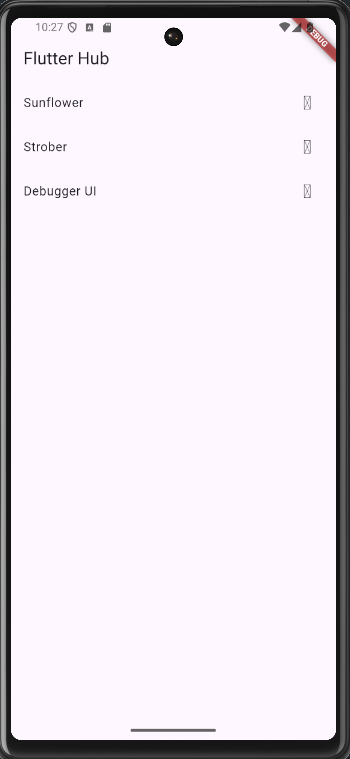
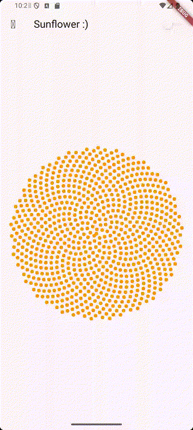
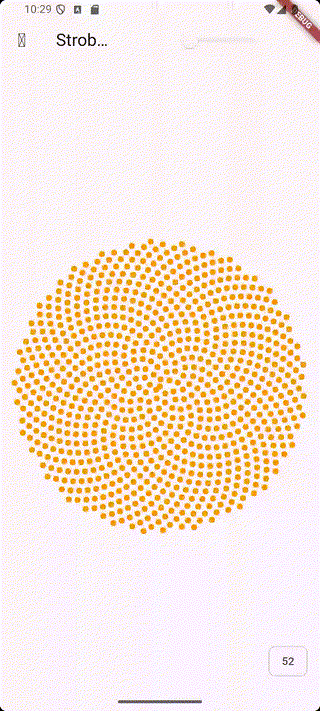

# flutter_sunflower

The Sunflower example as a Flutter app.


## Getting Started

For help getting started with Flutter, view our online
[documentation](http://flutter.io/).
---
---

# 🚀 Getting Started

### Prerequisites

- Flutter SDK installed (stable version)
- A device or emulator setup

#### Install Dependencies

```markdown
flutter pub get
```

#### Run the App

```markdown
flutter run
```

#### Run Tests
```markdown
flutter test
```

### 🧪 Features
- Demo Navigation: A list of demos shown on the home screen that navigate to different screens.

- Drawer Navigation: A side drawer that simulates code navigation (e.g., selecting main()).

- Counter Functionality: Basic interaction logic with a counter and floating action button.

- Testing: Example widget tests to ensure UI interactions work as expected.

### 🛠 Fixes and Improvements Made
- Fixed type casting issues (e.g., Object? to String or Widget)

- Replaced undefined DrawerItem with ListTile

- Ensured proper imports and usage of MyApp in widget tests

- Corrected test definitions and widget build contexts

## 📸 Screenshot



## 🎥 Demo

  

  


###  🙌 Author
- This project was built as a practice/demo app. You’re welcome to contribute, fork, or build on top of it.


## License

[MIT](https://choosealicense.com/licenses/mit/)
